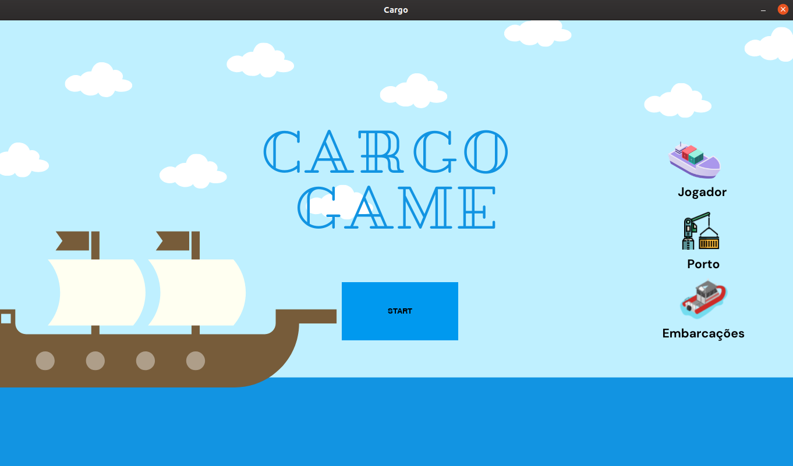
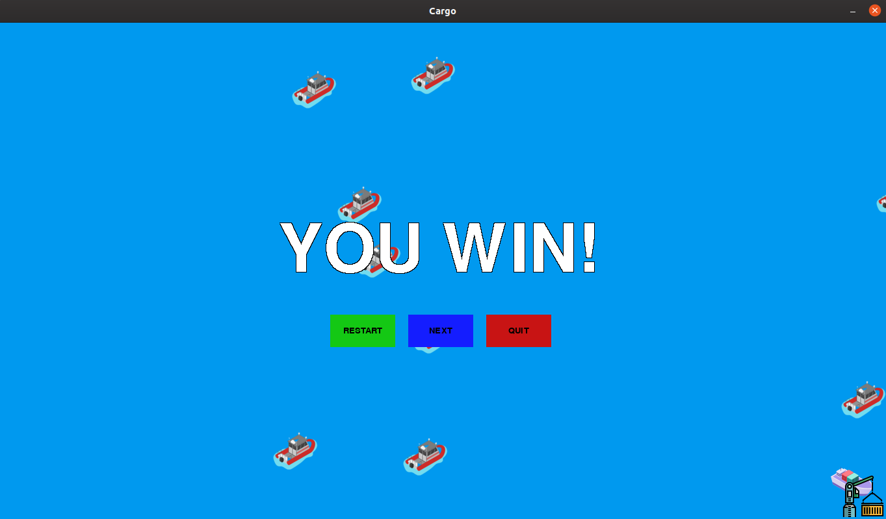
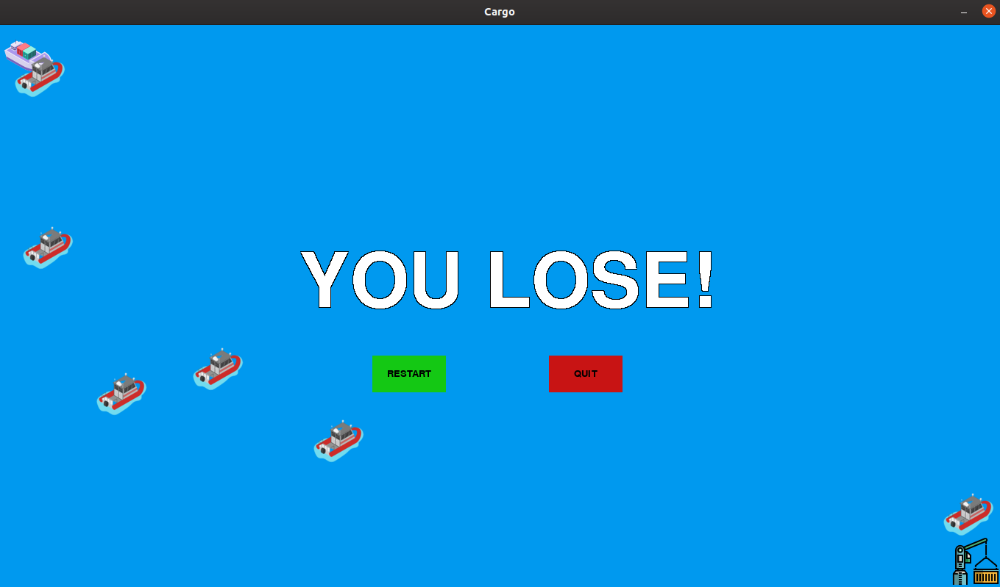
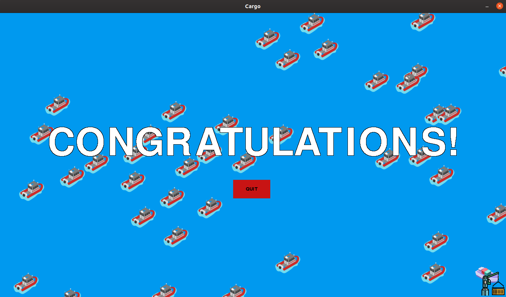

# Cargo

**Número da Lista**: 4<br>
**Conteúdo da Disciplina**: Dividir e Conquistar<br>

## Alunos
|Matrícula | Aluno |
| -- | -- |
| 17/0129411 |  Guilherme Mendes Pereira |
| 17/0163571 |  Murilo Loiola Dantas |

## Sobre 
Cargo é um jogo onde o jogador deve levar seu navio cargueiro até o porto sem colidir com outros navios. O projeto utiliza o algoritmo de Par de Pontos mais Próximos para detectar se houve uma colisão entre dois navios quaisquer.

## Screenshots
* #### Menu



* #### Tela de vitória da fase



* #### Tela de derrota



* #### Tela de vitória do jogo



## Instalação 
**Linguagem**: Python<br>
**Pré-requisitos**: [Python](https://www.python.org/downloads/), [pygame](https://www.pygame.org/wiki/GettingStarted) e [pip](https://packaging.python.org/tutorials/installing-packages/).<br>
**Execução do projeto** <br>

* Clone o repositório:
```bash
git clone https://github.com/projeto-de-algoritmos/D-C_Cargo.git
```
* Acesse o repositório e instale as bibliotecas necessárias:
```bash
cd D-C_Cargo/
pip3 install -r requirements.txt
```
* Execute o Cargo e divirta-se:
```bash
python3 src/game.py
```

## Uso 

### Vídeo explicativo
[Video](https://github.com/projeto-de-algoritmos/D-C_Cargo/blob/master/video_explicacao.mp4)

* Player - navio branco.
* Saída - porto.
* Obstáculos - navios vermelhos.

* Clique com o botão esquerdo do mouse em *Start*
* Controle o player com ←, ↑, →,  ↓ do teclado.
* Encontre a saída sem colidir com nenhum obstáculo.
* Clique em *Restart* para jogar novamente.
* Clique em *Next* para avançar de fase.
* Clique em *Quit* para encerrar o jogo.

## Outros 
A quantidade de navios "inimigos" que aparecem por segundo aumenta a cada fase. São 5 fases no total.


